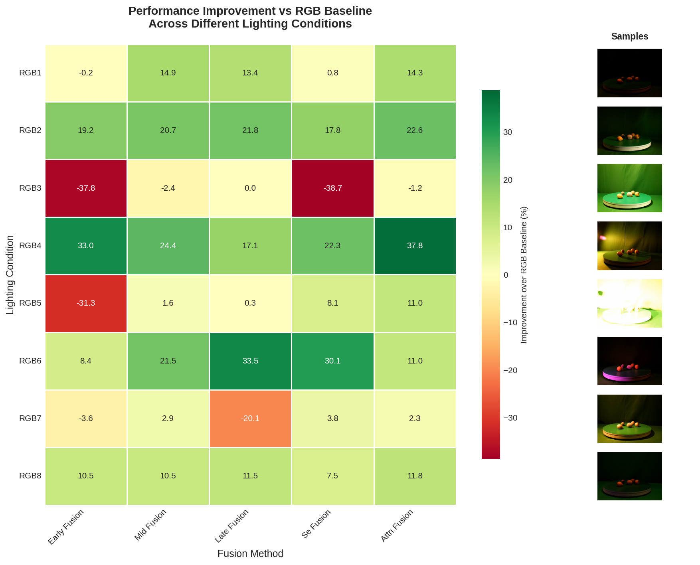
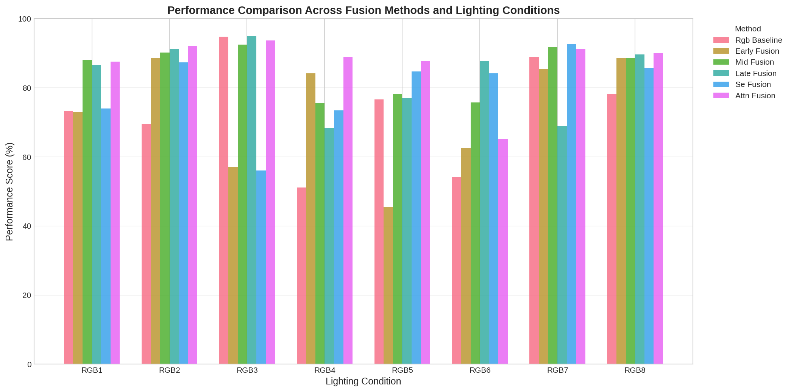
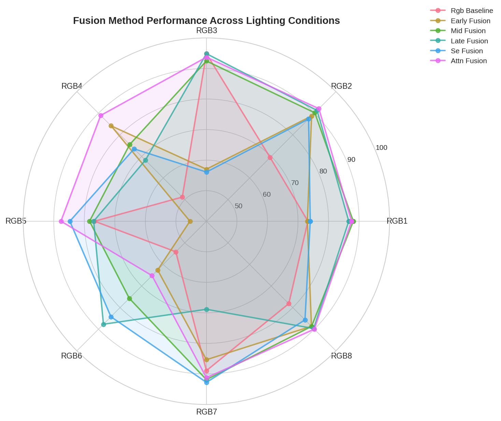
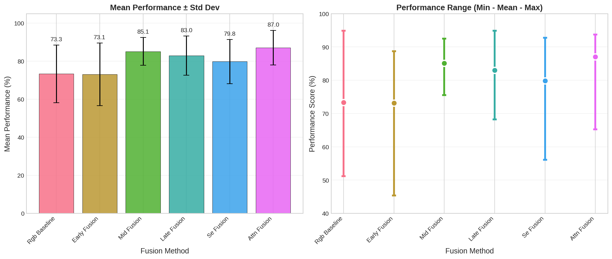

# RGB-D Multimodal Fusion for Semantic Segmentation

A PyTorch implementation of multimodal fusion networks combining RGB and Depth data for semantic segmentation, with progressive complexity and multiple merging techniques.

## Participants
Tianhao Li

Tania Shokor

Rua Mohamad

## Description of the Conducted Research 

### Motivation
Multimodal perception is essential for reliable scene understanding in real-world applications such as robotics, autonomous systems, inspection and agriculture. It is often insufficient to rely solely on RGB alone, since it is highly sensitive to lighting variations, color ambiguity and occlusions.

### Objective
#### Goal
Evaluate how different RGB-D fusion techniques affect semantic segmentation performance on the MM5 dataset.

#### Hypothesis
Mid-level, late-level and transformer-based RGB-D fusion methods will outperform early fusion and unimodal baselines.


### Why We Switched From Classification to Segmentation
The initial experiment attempted image classificatin using 324 images across 30 categories. The model overfitted severely:
* Train accuracy: 100%
* Validation accuracy: 92%

Reasons for abondoning classification:
* The dataset is too small for a 30-class classification task
* Class imabalance further harmed generalization
* Fusion could not be meaningfully evaluated because RGB alone already solved the task

Thus, we switched to segmentation, since it provides pixel-level supervision, making it more suitable to study modality fusion.

### Dataset
The [MM5_ALIGNED](https://github.com/martinbrennernz/MM5-Dataset) dataset is a recent dataset contaaining synchronized RGB, Depth, Thermal, UV and NIR images. It is well suited for fusion research because:
* Provides lighting variations (8 lighting setups)
* Depth data provides high-quality geometric cues for testing fusion effectiveness
* Includes imperfect, damaged and fake variants of real-world fruits and objects
* Clear pixel-wise segmentation masks are provided for all images

#### Dataset Specifications
* Total images: 324
  * 248 train / 76 val
* Modalities used:
  * RGB1-RGB8
  * Depth (D_FocusN)
* Resolution: 480x640 &rarr; 224x224
* Segmentation classes: 32 (31 object types + background)
* Object types: Good / Bad / Fake variants, multi-class and imbalanced

### Pipeline Overview
#### Preprocessing
* Resize to 224x224
* Normalize RGB using ImageNet mean/std
* Normalize Depth to [0, 1] range
* Load segmentation masks (0-31 pixel values)

#### Model Backbone
All experiments use a UNet encoder-decoder architecture built in PyTorch

#### Evaluation Protocol
* All models run across 8 RGB illumination variants
* Metric: mIoU

### Methodology
1. RGB Baseline\
The baseline model is a ResNet18-based UNet, using only RGB images as input. The ResNet-18 encoder extracts hierarchical features from the RGB input, while a symmetric decoder progressively upsamples these features to produce per-pixel semantic predictions. Skip connections are employed between encoder and decoder layers to preserve spatial details.

Key features:
* Standard ResNet-18 encoder with pretrained ImageNet weights
* UNet style decoder with upsampling blocks (UpBlock)
* Final classification layer predicts the desired number of semantic classes.

This baseline serves as a reference to evaluate the gains from the addition of depth data. 

2. Early Fusion\
The early fusion model concatenates the RGB and depth channels at the input, forming a 4-channel input (RGB+D). The fused input is fed into a modified ResNet18 encoder.

Key features:
* The first convolutional layer is adapted to accept 4 channels
* If using pretrained weights, RGB weights are copied, and the depth channel is initialized as the average of RGB weights.
* Encoder and decoder are otherwise similar to the RGB-only baseline.

Early fusion uses the depth information at the very start, potentially helping the network learn complementary features jointly with RGB.

3. Mid-level Fusion\
The mid-level fusion model merges RGB and depth features after intermediate layers in the encoder (in layer3). Seperate ResNet18 encoders are used for RGB and depth, and the resulting features are fused at multiple scales before being fed into a shared decoder.

Key features:
* Independent RGB and depth encoders
* Fusion occurs after intermediate layers (at layer3) using concatenation
* Decoder uses skip connections from the RGB encoder and fused features.

Mid-level fusion allows the network to first learn modality-specific features, and then to combine complementary representations at a higher semantic level.

4. Late Fusion\
The late fusion model involves two fully independent RGB and depth U-Nets. Each of which produce their own predictions, which is fused at the end, using averaging.

Key features:
* Two separate ResNetUNet models for RGB and Depth
* Depth encoder initialized with grayscale weights derived from the RGB model
* Prediction logits are merged by averaging them

Late fusion is resilient to modality-specific noise since the full capacity of each modality is preserved and only the final predictions are combined.

5. Squeeze-and-Excitation Fusion\
The SE fusion model involves adaptive gating and multi-scale fusion. Such model is able to learn to dynamically weight RGB vs depth based on featue quality, fuse information at multiple scales, and weight skip connections from both modalities by attention and confidence.

Key features:
* RGB and depth features are fuused at multiple encoder scales using the AdaptiveGatedFusion module
* Depth confidence is estimated per pixel to weight reliable regions higher
* Both channel attention and spatial attention refine fused features

SE fusion provides feature adaptivity, allowing the network to trust depth where it is reliable, while relying more on RGB elewhere.


6. Attention-based Fusion\
The attention-based fusion model includes a lightweight cross-attention mechanism between RGB and depth features at a higher semantic layer (layer3).

Key features:
* Features from RGB and depth are projected and passed through a small multi-head attention block (CrossAttention)
* The fused representation is used in the decoder alongside standard skip connections

Cross-attention allows the network to selectively highlight complementary information from depth and RGB features. This approach explicitly models interactions between the two modalities, improving segmentation in challenging regions.

## Project Structure

```
rgbd_fusion/
.
├── batch_train.sh
├── configs
│   ├── attn_fusion
│   ├── early_fusion
│   ├── late_fusion
│   ├── mid_fusion
│   ├── rgb_baseline
│   ├── se_fusion
├── data
│   ├── dataset_merge.py
│   ├── dataset.py
│   ├── __init__.py
├── eval.py
├── experiments
├── losses
│   ├── dice.py
│   └── __pycache__
├── MM5_SEG
│   ├── ANNO_CLASS
│   ├── classes.txt
│   ├── D_FocusN
│   ├── eval_dataset.csv
│   ├── label_mapping.csv
│   ├── RGB1
│   ├── RGB2
│   ├── RGB3
│   ├── RGB4
│   ├── RGB5
│   ├── RGB6
│   ├── RGB7
│   ├── RGB8
│   └── train_dataset.csv
├── models
│   ├── attn_fusion.py
│   ├── earlyfusion.py
│   ├── __init__.py
│   ├── latefusion.py
│   ├── midfusion.py
│   ├── resnet_unet.py
│   ├── sefusion.py
│   └── upblock.py
├── pyproject.toml
├── README.md
├── remap_dataset.py
├── results.txt
├── train.py
├── train.sh
├── utils
│   ├── __init__.py
│   └── metrics.py
└── uv.lock
```

---

## Installation

### Prerequisites
- Python 3.12+
- UV package manager (recommended) or pip
- CUDA-capable GPU (optional, works on CPU)

### Setup
```bash
# Install dependencies (using UV)
uv sync

# Or with pip
pip install torch torchvision tqdm tensorboard scikit-learn matplotlib seaborn pandas opencv-python pyyaml
```

## Quick Start

### Generate collapsed segmentation dataset
```bash
uv run remap_dataset.py
```

```bash
bash batch_train.sh
```

## Results

The following table summarizes the mean Intersection over Union (mIoU) achieved by six fusion methods across eight different lighting variations. This helps us identify both peak performance and robustness to illumination changes, which is critical for real-world perception systems.

|      | RGB baseline | Early Fusion | Mid Fusion | Late Fusion | SE Fusion | Attention Fusion |
|:----:|:------------:|:------------:|:----------:|:-----------:|:---------:|:----------------:|
| RGB1 |     73.25    |     73.06    |    88.11   |    86.63    |   74.01   |       87.55      |
| RGB2 |     69.51    |     88.72    |    90.20   |    91.28    |   87.34   |       92.11      |
| RGB3 |     94.85    |     57.03    |    92.47   |    94.86    |   56.10   |       93.69      |
| RGB4 |     51.18    |     84.17    |    75.53   |    68.27    |   73.50   |       88.98      |
| RGB5 |     76.65    |     45.40    |    78.29   |    76.93    |   84.74   |       87.65      |
| RGB6 |     54.17    |     62.60    |    75.72   |    87.70    |   84.23   |       65.20      |
| RGB7 |     88.93    |     85.34    |    91.87   |    68.83    |   92.77   |       91.23      |
| RGB8 |     78.17    |     88.65    |    88.70   |    89.69    |   85.67   |       89.98      |
|  Max |     94.85    |     88.72    |    92.47   |    94.86    |   92.77   |       93.69      |
| Mean |     75.73    |     74.85    |    85.93   |    84.34    |   81.24   |       87.79      |

Generally, early fusion underperforms compared to deeper fusion strategies. Eventhough it showed occasional improvement under specific lighting conditions, its mean performance (74.85 mIoU) is comparablle to the mean performance of the RGB-only baseline (75.73 mIoU). This highlights that fusion at the input level does not allow the network to learn meaningful cross-modal representations.

Mid Fusion shows strong consistency across all lighting variations, with a high mean performance of 85.93 mIoU. This shows that such fusion strategy allows better alignment between RGB and depth, despite not reaching the highest peak accuracy. 

Late Fusion achieves the highest peak performance (94.86 mIoU), which confirms that combining high-level modality-specific representations can be highly effective. On the other hand, its lower mean score (84.34 mIoU) indicates a sensivity to lighting variations, which suggest a less robust system.

SE Fusion consistently improves over early fusion and the RGB-only baseline. However, its lower mean mIoU (81.24 mIoU) compared to other deeper fusion strategies indicates that SE Fusion lacks the spatial annd contextual reasoning needed for optimal fusion.

Attention-based Fusion achieves the best overall performance, with the highest mean mIoU of 87.79 and strong results across all lighting conditions. This shows that attention mechanisms are particularly effective at dynamically weighting RGB and depth features, adapting well to lighting variations and scene conditions. 

The results across all 8 lighting variations (RGB1-RGB8) demonstrates that lighting conditions significantly affect the performance of the RGB-only segmentation (51.18-94.85 mIoU), while fusion-based strategies, especially mid-level and attention-based fusion, exhibit a substantially reduced performance variance.

Thus, we conclude that depth information contributes most effectively in:
* Poor or uneven lighting conditions
* Fake vs real object discrimination
* Occlusions and overlapping objects
* Accurate object boundary delineation

This confirms the complementary nature of depth as a geometric modality supporting RGB appearane cues.

Additional visualisation is provided below.






## Conclusion
The hypothesis is confirmed:
* Deeper fusion outperforms early fusion and RGB-only baseline
* Best score achieved: 94.86 mIoU (Late Fusion)
* Best overall robustness: 87.79 mean mIoU (Attention Fusion)


Therefore, in this project we:
* Built a complete RGB-D semantic segmentation pipeline
* Implemented and evaluated six fusion strategies
* Validated performance across eight lighting conditions
* Demonstrated the practical value of depth for robust segmentation

Potsential future work might include:
* Model calibration and reweighting for rare and underrepresented classes
* Evaluation of runtime, memory usage, and energy efficiency
* Exploration of tri-modal fusion (eg., RGB + Depth + Infrared)


## Reference List
1. Kaur, H., Koundal, D. & Kadyan, V. Image Fusion Techniques: A Survey. Arch Computat Methods Eng 28, 4425–4447 (2021). https://doi.org/10.1007/s11831-021-09540-7
2. C. Xiang et al., "Multi-Sensor Fusion and Cooperative Perception for Autonomous Driving: A Review," in IEEE Intelligent Transportation Systems Magazine, vol. 15, no. 5, pp. 36-58, Sept.-Oct. 2023, doi: 10.1109/MITS.2023.3283864.
3. Kaiming He, Xiangyu Zhang, Shaoqing Ren, & Jian Sun. (2015). Deep Residual Learning for Image Recognition.
4. Wu, L.-F., Wei, D., & Xu, C.-A. (2025). CFANet: The Cross-Modal Fusion Attention Network for Indoor RGB-D Semantic Segmentation. Journal of Imaging, 11(6), 177. https://doi.org/10.3390/jimaging11060177
5. D. Seichter, M. Köhler, B. Lewandowski, T. Wengefeld and H. -M. Gross, "Efficient RGB-D Semantic Segmentation for Indoor Scene Analysis," 2021 IEEE International Conference on Robotics and Automation (ICRA), Xi'an, China, 2021, pp. 13525-13531, doi: 10.1109/ICRA48506.2021.9561675.
6. Zongwei Wu, Zhuyun Zhou, Guillaume Allibert, Christophe Stolz, Cédric Demonceaux, Chao Ma, Transformer fusion for indoor RGB-D semantic segmentation, Computer Vision and Image Understanding, Volume 249, 2024, 104174, ISSN 1077-3142, https://doi.org/10.1016/j.cviu.2024.104174.
7. J. Zhang, H. Liu, K. Yang, X. Hu, R. Liu and R. Stiefelhagen, "CMX: Cross-Modal Fusion for RGB-X Semantic Segmentation With Transformers," in IEEE Transactions on Intelligent Transportation Systems, vol. 24, no. 12, pp. 14679-14694, Dec. 2023, doi: 10.1109/TITS.2023.3300537.
8. Zhang S and Xie M (2024) MIPANet: optimizing RGB-D semantic segmentation through multi-modal interaction and pooling attention. Front. Phys. 12:1411559. doi: 10.3389/fphy.2024.1411559
9. He Y, Chiu WC, Keuper M, Fritz M. Std2p: rgbd semantic segmentation using spatio-temporal data-driven pooling. In: 2017 IEEE Conference on Computer Vision and Pattern Recognition (CVPR); July 21 2017 to July 26 2017; Honolulu, HI, USA (2017). p. 7158–67.
10. Gupta S, Girshick R, Arbeláez P, Malik J. Learning rich features from rgb-d images for object detection and segmentation. Computer Vision–ECCV 2014: 13th Eur Conf Zurich, Switzerland, September 6-12, 2014, Proc Part VII (2014) 13:345–60. doi:10.1007/978-3-319-10584-0_23
11. Hazirbas C, Ma L, Domokos C, Cremers D. Fusenet: incorporating depth into semantic segmentation via fusion-based cnn architecture. Computer Vis – ACCV (2017) 2016:213–28. doi:10.1007/978-3-319-54181-5_14
12. Hu X, Yang K, Fei L, Wang K. Acnet: attention based network to exploit complementary features for rgbd semantic segmentation. In: 2019 IEEE International Conference on Image Processing (ICIP); 22-25 September 2019; Taipei, Taiwan (2019). p. 1440–4.
13. Zhang X, Zhang S, Cui Z, Li Z, Xie J, Yang J. Tube-embedded transformer for pixel prediction. IEEE Trans Multimedia (2023) 25:2503–14. doi:10.1109/tmm.2022.3147664
14. Chen LZ, Lin Z, Wang Z, Yang YL, Cheng MM. Spatial information guided convolution for real-time rgbd semantic segmentation. IEEE Trans Image Process (2021) 30:2313–24. doi:10.1109/tip.2021.3049332
15. Vaswani A, Shazeer N, Parmar N, Uszkoreit J, Jones L, Gomez AN, et al. Attention is all you need. Adv Neural Inf Process Syst (2017) 30. doi:10.48550/ARXIV.1706.03762
16. Fu J, Liu J, Tian H, Li Y, Bao Y, Fang Z, et al. Dual attention network for scene segmentation. In: 2019 IEEE/CVF Conference on Computer Vision and Pattern Recognition (CVPR); June 18 2022 to June 24 2022; New Orleans, LA, USA (2019). p. 3141–9.
17. Wang F, Jiang M, Qian C, Yang S, Li C, Zhang H, et al. Residual attention network for image classification. In: 2017 IEEE Conference on Computer Vision and Pattern Recognition (CVPR); July 21 2017 to July 26 2017; Honolulu, HI, USA (2017). p. 6450–8.
18. Hu J, Shen L, Sun G. Squeeze-and-excitation networks. In: 2018 IEEE/CVF Conference on Computer Vision and Pattern Recognition; June 18 2018 to June 23 2018; Salt Lake City, UT, USA (2018). p. 7132–41.
19. Huang Z, Wang X, Wei Y, Huang L, Shi H, Liu W, et al. Ccnet: criss-cross attention for semantic segmentation. IEEE Trans Pattern Anal Machine Intelligence (2023) 45:6896–908. doi:10.1109/tpami.2020.3007032
20. Zhu Z, He X, Qi G, Li Y, Cong B, Liu Y. Brain tumor segmentation based on the fusion of deep semantics and edge information in multimodal mri. Inf Fusion (2023) 91:376–87. doi:10.1016/j.inffus.2022.10.022
21. Angel Chang, Angela Dai, Thomas Funkhouser, Maciej Halber, Matthias Nießner, Manolis Savva, Shuran Song, Andy Zeng, & Yinda Zhang. (2017). Matterport3D: Learning from RGB-D Data in Indoor Environments.
22. Brenner, M., Reyes, N. H., Susnjak, T., & Barczak, A. L. (2025). MM5: Multimodal Image Capture and Dataset Generation for RGB, Depth, Thermal, UV, and NIR.
